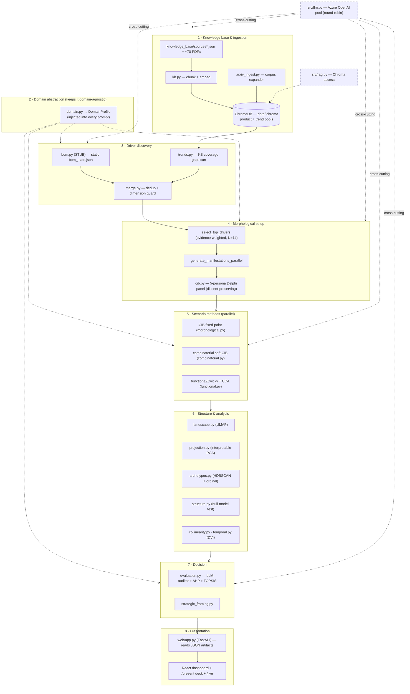
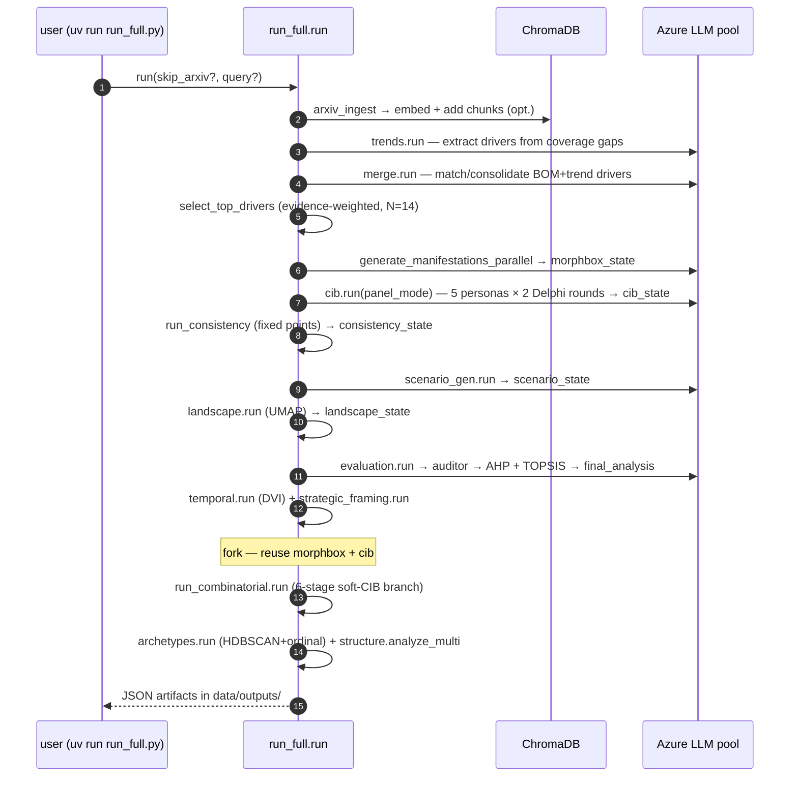
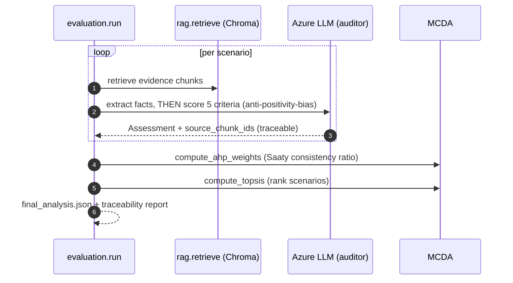
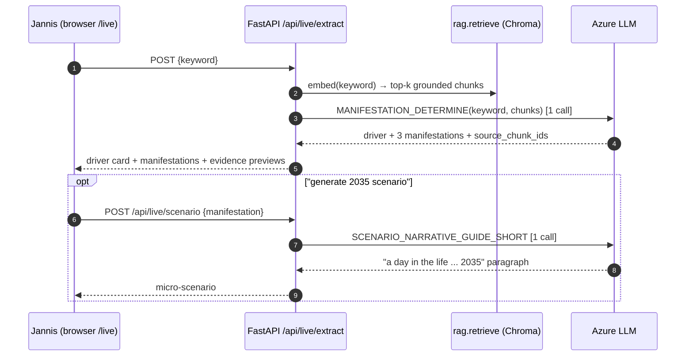

# Final Report + Prototype Handoff — Plan & Map

**Status:** planning · **Deadline:** final report due ~2026-07-27 (one week out) · **Owner:** Paul, with the team
**Course:** Digital Innovation Lab / Management & Digital Technologies II (LMU, 12 ECTS) · **Partner:** Rohde & Schwarz (PO Dr. Andrew Schaefer)
**Team 2:** Christian Diogo Götsch, Paul Keck, Aditya Purwar, Lovepreet Singh, Adam Foster-Baird

## Context — why this exists

Two things landed at once: the graded final report is due in a week, and Aditya + Jannis want the prototype explained "in a proper flow, with more words and diagrams" — like the presentation but written out — plus a way for Jannis to try it live. This document maps all three into one plan so the team isn't duplicating work in the last week:

1. **Final report** — a free-form results/roadblocks/insights write-up against the R&S proposal.
2. **Prototype walkthrough** — a standalone doc (architecture + sequence diagrams + narrative flow) for Adi/Jannis that *also* becomes the report's methodology section.
3. **Live "try it" demo** — a trimmed live-pipeline slice Jannis can drive from a keyword.

Decisions already made (2026-07-20): report is **free-form** (no formal LMU rubric exists in the repo — confirm page limit/citation style/submission format with the course separately); demo is the **trimmed live pipeline** (local-only, see §3 caveats); the walkthrough is a **standalone doc that feeds the paper**.

---

## What already exists (don't rebuild it)

| Asset | Where | Reuse for |
|---|---|---|
| Sprint 5 report (10 pp, 11 sections) | `sprint5-documentation.tex` → `Sprint_5_Report_Paul_Keck.pdf` | ~90% of the report's backbone: theory, results, limitations, references |
| From-scratch pipeline explainer (7 pp) | `pipeline_explained.tex/.pdf` | Walkthrough prose for a general reader |
| Canonical methodology | `METHODOLOGY.md`, `SPRINT_METHODOLOGY.md` | Methods section (⚠ older numbers — see reconcile box) |
| The honest core-finding write-up + all before/after numbers | `differentiation_fix_results.md` | Results + "we fixed the inputs, not the verdict" narrative |
| Talk script + Q&A | `TALK_TRACK.md`, `PRAESI_HANDOFF.md` | Narrative spine for the walkthrough |
| Report figures (money figs) | `report_figures/space_two_lenses.*`, `silhouette_by_lens.*`, `archetype_signatures.*` | Drop straight into report + walkthrough |
| Figure generators | `scripts/make_report_figures.py`, `make_before_after_pngs.py`, `make_burndown.py` | Regenerate if numbers change |
| R&S proposal (the only requirements source) | `topic/Digital Innovation Lab - Project Proposal ...docx` | The 4 objectives the report is graded against |

> **Reconcile before quoting — one number set only.** `SPRINT_METHODOLOGY.md` / `methodological_progress_report.txt` are the **old era** (4 scenarios / 29 drivers). The **current** figures (from the final run + `differentiation_fix_results.md`): **14 drivers → 268,435,456 combinations → 120 consistent scenarios → 5 named archetypes + ~40-scenario continuum halo**. Validation control: coupled 0.72 / z 8.6, uncoupled 0.22 / z −0.7, real field 0.07 / z 1.4. CIB inhibiting share ~0% → ~29% (Weimer-Jehle 20–30% band). Corpus enrichment: z 1.4 → 3.55 (significant at 2.0), 2875 → 3905 chunks. **Honesty caveat (keep it in):** 0.07 (one-hot·KMeans, all points) and 0.38 (ordinal·HDBSCAN, core only) are *different measurements* — never present as a "0.07 → 0.38 improvement."

---

## Deliverable 1 — Final report (free-form)

Map the report to the proposal's four objectives so grading ("meaningful, grounded insights at scale") lands directly. Extend the Sprint 5 material but **rebalance away from Scrum/backlog/burndown** (those shrink to a short "process" note) toward problem → method → results → insight.

**Proposed structure**
1. **Problem & motivation** — R&S's question ("which monitoring products will we need in 2035?"); framework-as-deliverable, spectrum as test case; traceability as a hard requirement.
2. **Approach overview** — Plan C hybrid (bottom-up BOM × top-down trends); one architecture figure (from Deliverable 2).
3. **Method** — KB → drivers → morphological box → CIB Delphi panel → scenario field → structure/archetypes → MCDA. *This is the walkthrough's methods prose (D2), condensed.*
4. **Results** — the money figures: `space_two_lenses` (blob vs archetypes), `silhouette_by_lens`, `archetype_signatures`; the 5 archetypes; **Objective 4** = MCDA (AHP+TOPSIS) ranking of which scenarios are impactful/probable.
5. **Validation & the honest finding** — the 3-way synthetic control (engine doesn't hallucinate clusters); hybrid core+continuum; inputs-fixed-not-verdict.
6. **LLM-as-judge reflection** *(the proposal explicitly asks for this)* — the grounded pointwise auditor in `evaluation.py` (fact-extraction-before-scoring to counter positivity bias), its limits (model variance, compression), the dissent-preserving CIB panel as a mitigation.
7. **Reusable framework** — domain-agnostic proof: agriculture corpus, zero code change; `run_full.py` one-command run; docked-KB design.
8. **Roadblocks & limitations** — continuum halo, corpus skew, single-product BOM stub, MCDA compression, S7 R&S local-inference carry-over.
9. **Outlook** + short **process** note + **references** (already 11 in the Sprint 5 `.tex`).

**Map to the 4 objectives (make this explicit so nothing reads as missing):** O1 grounded KB → §3/§7; O2 drivers with descriptive structure → §3/§4; O3 plausible scenarios at scale → §4; O4 impact/probability analysis → §4 (MCDA) + §5.

**Action:** extend `sprint5-documentation.tex` in place (keep the LaTeX toolchain — `latexmk`), or fork a `final-report.tex` from it. Credit the whole team by name per contribution (bus-factor matters for the grade); keep the tone understated, no self-glazing.

---

## Deliverable 2 — Prototype walkthrough (standalone → feeds the paper)

A document that walks the reader through the system "in a proper flow, with more words and diagrams," for Adi/Jannis. Its diagrams and methods prose are lifted straight into report §2–§3. Structure: (a) one architecture diagram, (b) 3–4 sequence diagrams for the runtime flows, (c) narrative that follows one driver through the pipeline (mirrors `TALK_TRACK.md`'s "follow one driver, then ask can we trust it").

**The diagrams are built and rendered** in `report_figures/diagrams/` — authored in **draw.io** (`.drawio`, editable) in the `lmu/ecm` house style, exported to `.svg`/`.pdf`/`.png`: `architecture`, `pipeline_run` (the 14-stage run + fork), `driver_journey` (the narrative spine), `evaluation` (LLM-as-judge). See `report_figures/diagrams/README.md`. The Mermaid drafts below are kept for quick reference (also in `report_figures/diagrams/mermaid/`, incl. a `dataflow` artifact-chain diagram).

### 2a. Architecture (component / layered)

### 2b. Sequence — full pipeline run (`run_full.run`)

### 2c. Sequence — grounded evaluation (Objective 4 + LLM-as-judge)

### 2d. Sequence — the live "try it" demo (Deliverable 3)

---

## Deliverable 3 — Live "try it" demo (trimmed pipeline)

**Goal:** Jannis types a technology/trend keyword and, in a few seconds, sees the *core value* — grounded retrieval → one LLM extraction → a driver + 3 manifestations (optimistic→pessimistic) with source citations, and optionally a one-paragraph 2035 micro-scenario. This mirrors the real manifestation + scenario stages with **1–2 LLM calls**, not the full minutes-long run.

**Reuse (no new pipeline logic):**
- `src.rag.get_collection()`, `src.rag.retrieve(collection, keyword, pool, n)`, `format_rag_chunks` — `src/rag.py`
- `src.llm.validated_chat_json` / `safe_chat_json`
- Prompt `MANIFESTATION_DETERMINE` (`src/prompts/morphological.py`) — same call pattern as `generate_manifestations_parallel` in `scripts/run_subset.py:72`
- Prompt `SCENARIO_NARRATIVE_GUIDE_SHORT` (`src/prompts/scenarios.py`) for the optional micro-scenario
- `domain.load_profile()` for the `{domain}/{horizon}` prompt slots

**Backend — `web/app.py` (~40–60 lines):**
- `POST /api/live/extract` body `{keyword, kb}` → retrieve k≈8 → one LLM call → `{driver, manifestations[], sources[{title, preview, chunk_id}]}`.
- `POST /api/live/scenario` body `{driver, manifestation, kb}` → one narrative paragraph.
- `GET /api/live/available` → checks Azure keys + Chroma collection exist; drives whether the UI shows the page.
- **Lazy-import** `numpy/openai/chromadb` *inside* the handlers so the minimal Azure deploy never crashes at import; wrap in try/except returning a clean error.

**Frontend (rebuild required — `cd web/frontend && npm run build` → `web/static/`):**
- New `pages/LivePage.jsx` (route `/live` in `App.jsx`; nav item in `SideNav.jsx`, guarded by `/api/live/available`).
- Input + Run button + loading state; render driver card (reuse `ui/Card`, `MetricCard`, `Badge`), manifestations (reuse `viz/MorphGrid` or a simple plausibility-badged list), evidence chain (reuse the `scenarios/EvidencePanel` pattern), and a per-manifestation "generate 2035 scenario" button.
- Ship a known-good example keyword (e.g. "dynamic spectrum sharing") as a one-click default so the live demo never starts on a blank screen.

> **⚠ Caveats (why this is local-only).** The Azure web deploy (`requirements-web.txt`) ships only `fastapi/uvicorn/gunicorn` — no `openai/chromadb/numpy` — and carries no Azure OpenAI keys. So run the demo **locally on Paul's laptop** for the Jannis meeting: `uv run uvicorn web.app:app --port 8000` with `.env` present. Latency is a few seconds/call and LLM output varies run-to-run — hence the default keyword and the graceful-error handling. Putting it on the public deploy would mean adding the heavy deps + secrets to Azure; out of scope for the demo, note it as "possible future hardening."

---

## One-week timeline

| Day | Focus | Output |
|---|---|---|
| 1–2 | Report skeleton (free-form) + **reconcile numbers** (one set only) + pull figures | `final-report.tex` scaffold |
| 2–3 | Walkthrough doc + finalize the 4 diagrams (render to PNG/SVG) | D2 doc; figures shared into report §2–3 |
| 3–4 | Build + locally test the live demo | `/live` working against `.env` |
| 4–5 | Draft Results, Validation, **LLM-as-judge reflection**, Limitations | report §4–8 |
| 5–6 | Meeting with Adi/Jannis — walk the doc, demo `/live`; integrate feedback | reviewed drafts |
| 7 | Polish, proofread, `latexmk` → PDF, confirm submission format, submit | final PDF |

**Confirm with the course (not in repo):** page limit, citation style, submission format/portal, exact deadline.

---

## Verification

- **Diagrams:** paste each Mermaid block into a GitHub preview or `mermaid.live`; export PNG/SVG for the PDF.
- **Figures:** `uv run python scripts/make_report_figures.py` regenerates the three money figures from current `data/outputs/*.json` — diff against `report_figures/` to confirm numbers match the report text.
- **Live demo:** locally `uv run uvicorn web.app:app --port 8000`, `curl -X POST localhost:8000/api/live/extract -d '{"keyword":"dynamic spectrum sharing","kb":"spectrum"}'` returns a driver + manifestations + resolved sources in a few seconds; then load `/live` in the browser and run the same keyword end-to-end. Confirm `GET /api/live/available` returns false (and the nav hides `/live`) when `.env`/Chroma is absent, so the Azure deploy stays intact.
- **Report:** `latexmk -pdf final-report.tex` builds clean; every quoted number traces to a `data/outputs` artifact or `differentiation_fix_results.md`.
