# Pipeline Architecture — Technology Foresight System

```mermaid
flowchart TD
    %% ── INGESTION ──────────────────────────────────────────────
    DOCS["📄 45 Source Documents
    ITU · RSPG · WRC-23 · ECC · FCC · R&S specs"]

    DOCS --> KB[("🗄️ ChromaDB Vector Store
    2,850 chunks · text-embedding-3-small
    pool: product | trend")]

    %% ── TWO PARALLEL TRACKS ────────────────────────────────────
    KB --> PROD["Product Pool
    R&S hardware documentation"]
    KB --> TPOOL["Trend Pool
    Regulatory · Policy · Foresight"]

    subgraph TRACK_A ["① BOM Track"]
        direction TB
        PROD --> BOM["LLM Hierarchical Decomposition
        R&S ESMW receiver → subsystems
        → components → tech drivers"]
        BOM --> BOM_OUT["27 Technology Drivers
        bom_state.json"]
    end

    subgraph TRACK_B ["② Trend Track  (KB Coverage-Gap)"]
        direction TB
        TPOOL --> GAP["1. Embed BOM descriptions
        2. Cosine sim: chunk → nearest BOM driver
        3. Orphans = sim &lt; 0.55  →  2,559 chunks
        4. K-Means cluster  (k=12)
        5. LLM extracts driver per cluster
        6. Post-filter: drop sim &gt; 0.70 to BOM"]
        GAP --> TREND_OUT["12 Environmental Drivers
        Regulatory · Market · Geopolitical
        trend_state.json"]
    end

    BOM_OUT -.->|"coverage reference"| GAP

    %% ── MERGE ──────────────────────────────────────────────────
    BOM_OUT --> MERGE
    TREND_OUT --> MERGE

    MERGE["Merge + Deduplicate
    LLM matching → unified name
    cosine dedup (0.85) → LLM semantic grouping
    origin tags: both / bom / trend"]

    MERGE --> MERGE_OUT["18 Unified Drivers
    merge_state.json"]

    %% ── SELECTION ──────────────────────────────────────────────
    MERGE_OUT --> SEL["Evidence-Weighted Driver Selection
    score = 0.5 × origin_weight + 0.5 × evidence_depth
    origin: both=1.0 · trend=0.4 · bom=0.3"]

    SEL --> SEL_OUT["14 Selected Drivers
    6 hardware · 4 regulatory · 4 component"]

    %% ── MORPHOLOGICAL BOX ──────────────────────────────────────
    SEL_OUT --> MANIF["Manifestation Generation
    4 LLM-generated states per driver
    RAG-grounded · full KB"]

    MANIF --> MORPHBOX["🔲 Morphological Box
    14 drivers × 4 states = 56 manifestations
    4¹⁴ = 268,435,456 possible futures
    morphbox_state.json"]

    %% ── CIB / DELPHI ───────────────────────────────────────────
    MORPHBOX --> CIB["CIB Matrix — Simulated Delphi
    4 LLM personas × 182 driver pairs = 728 evaluations
    Scale: −3 (inhibiting) → +3 (enabling)
    Monte Carlo over persona disagreement"]

    CIB --> CIB_OUT["14×14 Interaction Matrix
    Consensus: strong / moderate / divergent
    cib_state.json"]

    %% ── CONSISTENCY ────────────────────────────────────────────
    MORPHBOX --> CONS
    CIB_OUT --> CONS

    CONS["Consistency Analysis
    Weimer-Jehle fixed-point algorithm
    2,000 MC samples × 100 restarts per sample
    + single-driver-flip near-neighbors"]

    CONS --> CONS_OUT["106 Fixed Points + ~4,000 neighbors
    → 20 seeds  (Hamming distance ≥ 4)
    typed: disruptive · cautionary · wildcard
    consistency_state.json"]

    %% ── SCENARIO GENERATION ────────────────────────────────────
    CONS_OUT --> SCEN["Scenario Generation
    LLM narrative per seed · RAG-grounded
    Title · narrative · assumptions · tensions"]

    SCEN --> SCEN_OUT["20 Scenarios
    scenario_state.json"]

    %% ── EVALUATION ─────────────────────────────────────────────
    SCEN_OUT --> UMAP["UMAP Landscape
    Embed narratives → 2D projection
    Pairwise cosine similarity"]

    SCEN_OUT --> MCDA["MCDA Evaluation
    LLM scores 5 criteria per scenario
    AHP weights · TOPSIS ranking
    risk_severity = cost criterion"]

    UMAP --> DASH["📊 Dashboard
    FastAPI · Plotly
    Full traceability: scenario → driver → source"]
    MCDA --> DASH
```

---

## Key Numbers at a Glance

| Stage | Input | Output |
|---|---|---|
| Knowledge Base | 45 documents | 2,850 chunks |
| BOM Decomposition | product pool | 27 tech drivers |
| Trend Scanner | trend pool (2,638 chunks) | 12 env. drivers |
| Merge | 39 drivers | 18 unified drivers |
| Driver Selection | 18 drivers | 14 selected |
| Morphological Box | 14 drivers | 56 states · 268M combinations |
| CIB / Simulated Delphi | 182 pairs × 4 personas | 728 scored interactions |
| Consistency Analysis | 268M combinations | 106 fixed points → 20 seeds |
| Scenario Generation | 20 seeds | 20 narratives |
| MCDA | 20 scenarios | 20 ranked scenarios |

---

## Methodological Anchors

| Component | Method |
|---|---|
| Driver extraction (technology) | Bill of Materials decomposition (BOM) |
| Driver extraction (environment) | KB coverage-gap · K-Means · cosine similarity |
| Driver interaction scoring | Cross-Impact Balance (Weimer-Jehle) |
| Expert elicitation | Simulated Delphi (LLM persona panel) |
| Uncertainty modeling | Monte Carlo sampling over persona disagreement |
| Scenario space search | Fixed-point iteration · near-consistent neighbors |
| Scenario ranking | AHP + TOPSIS (multi-criteria decision analysis) |
| Scenario visualization | UMAP dimensionality reduction |
