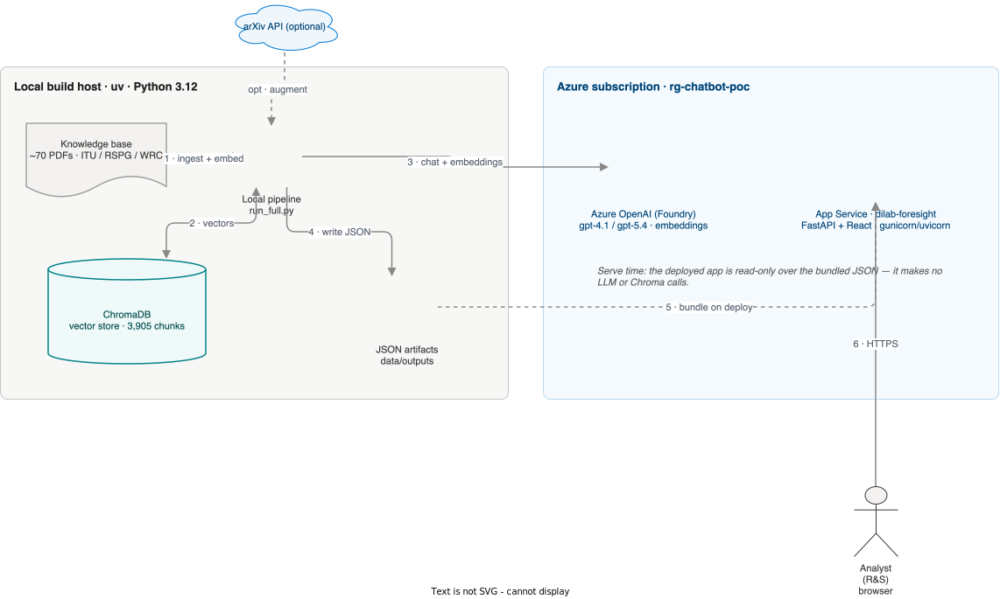
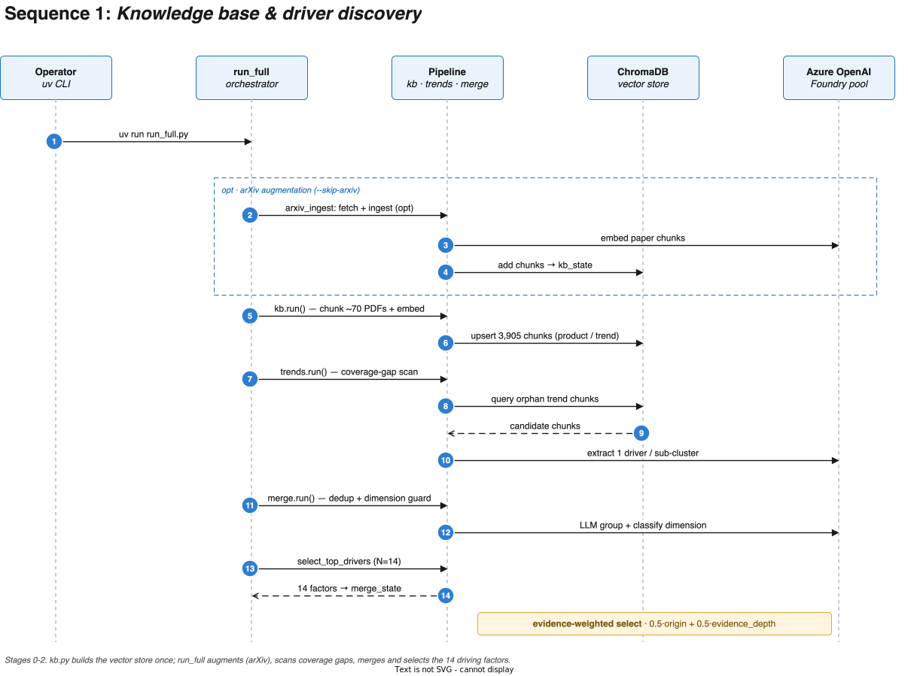
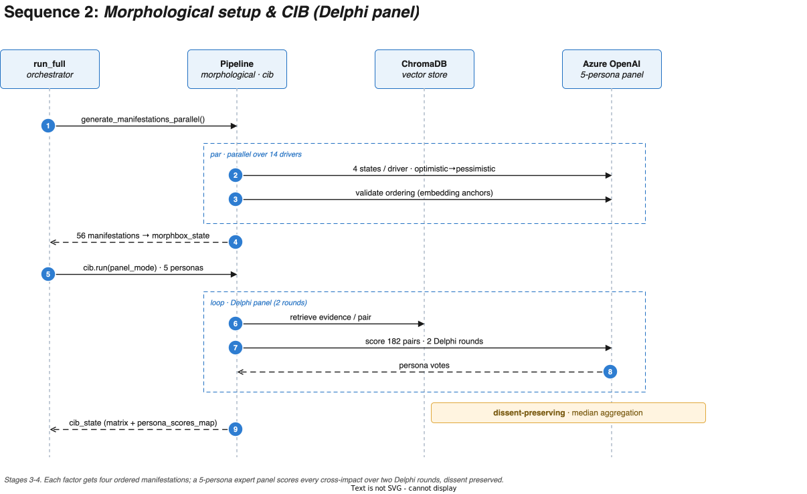
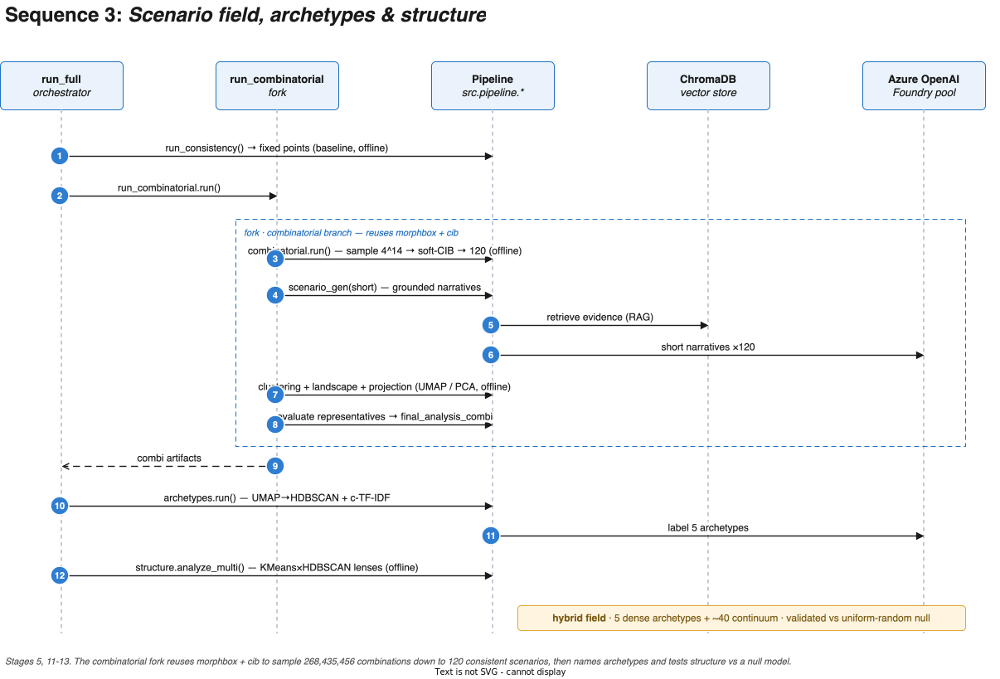
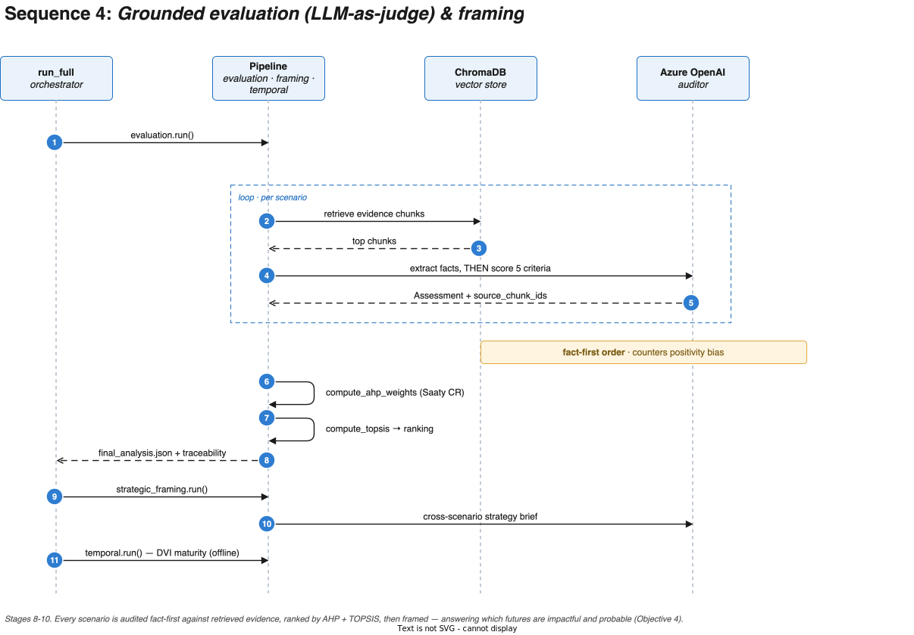

# Prototype diagrams — architecture & sequences (draw.io)

Source-of-truth diagrams for the final report and the prototype walkthrough for Adi/Jannis. Authored in **draw.io** (`.drawio`, editable in <https://app.diagrams.net> or the VS Code Draw.io extension), styled to match the `lmu/ecm` house look, exported to `.svg` (web), cropped `.pdf` (LaTeX), and 2× `.png` (slides).

Numbers are **as of the final run** — see the reconcile box in `../../FINAL_DELIVERABLES_PLAN.md`.
Canonical chain: 70 sources → 3,905 chunks → 14 factors → 56 manifestations → 268,435,456 combinations → 5-persona CIB × 182 pairs → 120 scenarios → 5 archetypes + ~40 continuum.

## Architecture

| File | What it shows |
|---|---|
| `architecture` | **Azure deployment / service view** with real Azure icons: local pipeline → Azure OpenAI + ChromaDB → JSON artifacts → App Service (`dilab-foresight`) → analyst |
| `architecture_pipeline` | **Functional view**: 5 phase cards + cross-cutting services; the 3 scenario methods forking off the shared box + matrix |
| `driver_journey` | Narrative flow: one factor from ~70 sources → manifestations → CIB → 120 scenarios → 5 archetypes |



## Sequence diagrams (UML, `chatbot_poc/docs/diagrams` house style)

Four focused sequence diagrams that together cover the whole `run_full` pipeline — participant headers (`#EAF3FB`/`#1F6FC2`), dashed lifelines, solid-call / dashed-return arrows, numbered blue step badges, `par`/`loop`/`opt`/`fork` fragment boxes, and amber grounding notes.

| File | Stages | Flow |
|---|---|---|
| `seq_ingestion` | 0–2 | Knowledge base & driver discovery → 14 factors |
| `seq_cib` | 3–4 | Manifestations (par) + 5-persona Delphi panel (loop) → morphbox + cib |
| `seq_field` | 5, 11–13 | Combinatorial fork → 120 scenarios → archetypes → structure test |
| `seq_evaluation` | 8–10 | Grounded LLM-as-judge (loop) → AHP + TOPSIS → framing (Objective 4) |






## Editing & re-exporting

`.drawio` is the source. After editing (app.diagrams.net or VS Code extension), re-export with the `drawio` desktop CLI:

```bash
cd report_figures/diagrams
drawio -x -f svg --no-sandbox -o seq_field.svg seq_field.drawio            # web / GitHub
drawio -x -f pdf --crop --no-sandbox -o seq_field.pdf seq_field.drawio     # LaTeX (vector, cropped)
drawio -x -f png --scale 2 --no-sandbox -o seq_field.png seq_field.drawio  # slides / preview
```

The four sequence diagrams are generated from `/tmp/genseq.py` (coordinate-driven) — edit there and re-run to regenerate all four consistently, or tweak the `.drawio` directly.

### Icon note (architecture)
Real Azure icons come from draw.io's bundled `img/lib/azure2/*` **image** shapes (these export through the CLI): `ai_machine_learning/Azure_OpenAI.svg`, `compute/App_Services.svg`, `storage/Storage_Accounts.svg`, `compute/Virtual_Machine.svg`. The `mxgraph.mscae.*` / `mxgraph.azure.*` stencils mostly render blank in CLI export — prefer `azure2` image shapes. ChromaDB has no vendor icon (teal cylinder).

## `mermaid/` — alternative source
Earlier Mermaid versions (architecture, dataflow artifact-chain, and Mermaid sequence drafts) live in `mermaid/` — editable text that renders on GitHub / mermaid.live.
